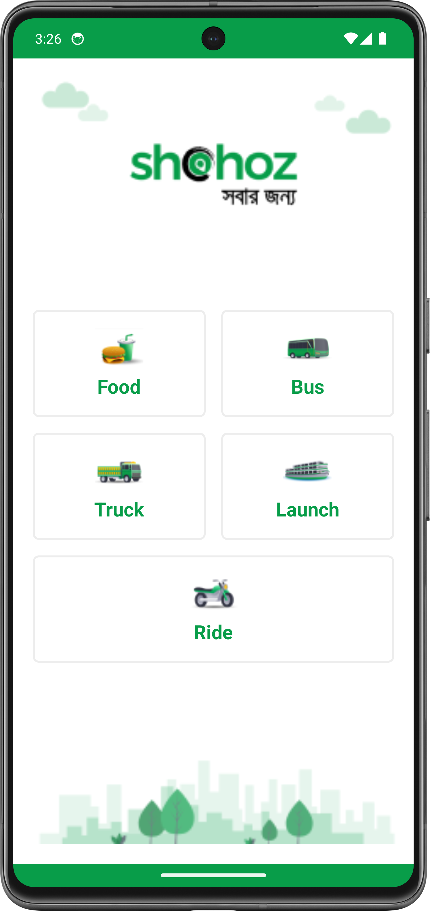

<p>
  <h3>🎀 Shohoz App Design by <a href="https://www.linkedin.com/in/shuvostudiolimited/"><b>Shuvo Sarkar</b></a></h3>
  <div align="center" width="100"></div>
  <br/>
</p>

**Step 1 :** Create a Your Android Project.


**Step 2 :** Download images and paste your drawable folder.


**Step 3 :** Create a Drawable Resource File named `box_back.xml` under your drawable folder and paste the code.
```xml

<?xml version="1.0" encoding="utf-8"?>
<shape xmlns:android="http://schemas.android.com/apk/res/android">
    <corners android:radius="5dp"/>
    <solid android:color="@color/white"/>
    <stroke android:width="2dp" android:color="#EDEDED"/>
</shape>

```

**Step 4 :** Copy this code and paste your `activity_main.xml` file.
```xml

<?xml version="1.0" encoding="utf-8"?>
<RelativeLayout xmlns:android="http://schemas.android.com/apk/res/android"
    xmlns:app="http://schemas.android.com/apk/res-auto"
    xmlns:tools="http://schemas.android.com/tools"
    android:layout_width="match_parent"
    android:layout_height="match_parent"
    tools:context=".MainActivity"
    >


        <ImageView
            android:id="@+id/logo"
            android:layout_width="match_parent"
            android:layout_height="200dp"
            android:layout_alignParentTop="true"
            android:src="@drawable/logo"
        />


        <LinearLayout
            android:layout_width="match_parent"
            android:layout_height="match_parent"
            android:orientation="vertical"
            android:layout_above="@id/bottom_back"
            android:layout_below="@id/logo"
            >


            <LinearLayout
                android:layout_width="match_parent"
                android:layout_height="match_parent"
                android:gravity="center"
                android:orientation="vertical"
                >

                <LinearLayout
                    android:layout_width="match_parent"
                    android:layout_height="110dp"
                    android:gravity="center"
                    android:orientation="horizontal"
                    android:layout_marginLeft="20dp"
                    android:layout_marginRight="20dp"
                    android:layout_marginTop="8dp"
                    android:layout_marginBottom="8dp"
                    >

                    <LinearLayout
                        android:layout_width="match_parent"
                        android:layout_height="match_parent"
                        android:gravity="center"
                        android:orientation="vertical"
                        android:layout_weight="1"
                        android:background="@drawable/box_back"
                        android:layout_marginRight="8dp"
                        android:clickable="true"
                        android:foreground="?attr/selectableItemBackground"
                        >

                        <ImageView
                            android:layout_width="50dp"
                            android:layout_height="50dp"
                            android:scaleType="fitCenter"
                            android:src="@drawable/burger"
                        />

                        <TextView
                            android:layout_width="wrap_content"
                            android:layout_height="30dp"
                            android:text="Food"
                            android:textColor="@color/main"
                            android:textSize="20sp"
                            android:textStyle="bold"
                        />

                    </LinearLayout>


                    <LinearLayout
                        android:layout_width="match_parent"
                        android:layout_height="match_parent"
                        android:gravity="center"
                        android:orientation="vertical"
                        android:layout_weight="1"
                        android:background="@drawable/box_back"
                        android:layout_marginLeft="8dp"
                        android:clickable="true"
                        android:foreground="?attr/selectableItemBackground"
                        >

                        <ImageView
                            android:layout_width="50dp"
                            android:layout_height="50dp"
                            android:scaleType="fitCenter"
                            android:src="@drawable/bus"
                        />

                        <TextView
                            android:layout_width="wrap_content"
                            android:layout_height="30dp"
                            android:text="Bus"
                            android:textColor="@color/main"
                            android:textSize="20sp"
                            android:textStyle="bold"
                        />

                    </LinearLayout>


                </LinearLayout>


                <LinearLayout
                    android:layout_width="match_parent"
                    android:layout_height="110dp"
                    android:gravity="center"
                    android:orientation="horizontal"
                    android:weightSum="2"
                    android:layout_marginLeft="20dp"
                    android:layout_marginRight="20dp"
                    android:layout_marginTop="8dp"
                    android:layout_marginBottom="8dp"
                    >

                    <LinearLayout
                        android:layout_width="match_parent"
                        android:layout_height="match_parent"
                        android:gravity="center"
                        android:orientation="vertical"
                        android:layout_weight="1"
                        android:background="@drawable/box_back"
                        android:layout_marginRight="8dp"
                        android:clickable="true"
                        android:foreground="?attr/selectableItemBackground"
                        >

                        <ImageView
                            android:layout_width="50dp"
                            android:layout_height="50dp"
                            android:scaleType="fitCenter"
                            android:src="@drawable/truck"
                        />

                        <TextView
                            android:layout_width="wrap_content"
                            android:layout_height="30dp"
                            android:text="Truck"
                            android:textColor="@color/main"
                            android:textSize="20sp"
                            android:textStyle="bold"
                        />


                    </LinearLayout>


                    <LinearLayout
                        android:layout_width="match_parent"
                        android:layout_height="match_parent"
                        android:gravity="center"
                        android:orientation="vertical"
                        android:layout_weight="1"
                        android:background="@drawable/box_back"
                        android:layout_marginLeft="8dp"
                        android:clickable="true"
                        android:foreground="?attr/selectableItemBackground"
                        >

                        <ImageView
                            android:layout_width="50dp"
                            android:layout_height="50dp"
                            android:scaleType="fitCenter"
                            android:src="@drawable/launch"
                        />

                        <TextView
                            android:layout_width="wrap_content"
                            android:layout_height="30dp"
                            android:text="Launch"
                            android:textColor="@color/main"
                            android:textSize="20sp"
                            android:textStyle="bold"
                        />


                    </LinearLayout>

                </LinearLayout>


                <LinearLayout
                    android:layout_width="match_parent"
                    android:layout_height="110dp"
                    android:gravity="center"
                    android:orientation="horizontal"
                    android:weightSum="2"
                    android:layout_marginLeft="20dp"
                    android:layout_marginRight="20dp"
                    android:layout_marginTop="8dp"
                    android:layout_marginBottom="16dp"
                    >

                    <LinearLayout
                        android:layout_width="match_parent"
                        android:layout_height="match_parent"
                        android:gravity="center"
                        android:orientation="vertical"
                        android:background="@drawable/box_back"
                        android:clickable="true"
                        android:foreground="?attr/selectableItemBackground"
                        >

                        <ImageView
                            android:layout_width="50dp"
                            android:layout_height="50dp"
                            android:scaleType="fitCenter"
                            android:src="@drawable/ride"
                        />

                        <TextView
                            android:layout_width="wrap_content"
                            android:layout_height="30dp"
                            android:text="Ride"
                            android:textColor="@color/main"
                            android:textSize="20sp"
                            android:textStyle="bold"
                        />

                    </LinearLayout>


                </LinearLayout>

            </LinearLayout>


        </LinearLayout>


        <ImageView
            android:id="@+id/bottom_back"
            android:layout_width="match_parent"
            android:layout_height="140dp"
            android:layout_alignParentBottom="true"
            android:src="@drawable/bottom_back" 
        />


</RelativeLayout>
```
## Authors

**Shuvo Sarkar** - Learner | App Developer | Mern Stack Web Developer 

<h2 align="center">Thank You 🥰</h2>